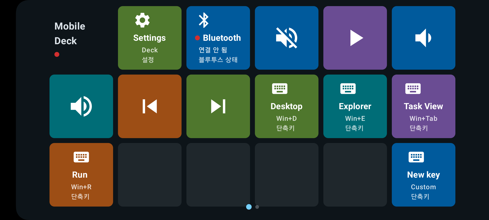

# MobileDeck

MobileDeck은 Android 휴대폰을 Windows PC용 Bluetooth HID 매크로 덱처럼 사용할 수 있게 해주는 앱입니다. PC에 별도 Companion 앱을 설치하지 않아도 키보드 단축키, 미디어 키, 텍스트 입력, `Win+R` 기반 실행 명령을 보낼 수 있습니다.

## 주요 기능

- Bluetooth HID 키보드 등록 및 PC 페어링
- 음소거, 볼륨, 재생/일시정지, 정지, 이전/다음 같은 미디어 키
- 사용자 지정 단축키, 텍스트 입력, `Win+R` 실행 명령 fallback
- 제목, 부제목, 아이콘 문자, 이미지 아이콘, 색상, 입력값, 동작 유형을 편집할 수 있는 덱 키
- 최대 5개 페이지
- 현재 페이지를 보여주는 점 인디케이터
- 페이지 전환용 2/3손가락 멀티터치 스와이프
- 가로/세로 페이지 슬라이드 방향 선택
- 첫 페이지와 마지막 페이지에서 순환 전환 여부 선택
- 행/열, 키 편집, 드래그 이동을 지원하는 레이아웃 편집기
- 사이드바 너비, 행 높이, 행 순서, 버튼 맞교환 편집을 지원하는 콘솔 UI 전용 레이아웃 편집기
- 아이콘, 아이콘 + 키워드, 키워드 전용 표시 방식
- 키 편집 화면의 아이콘 선택 및 미디어 키 기능 선택 드롭다운
- 사용자 지정 아이콘/배경 이미지를 포함하는 덱 번들 내보내기 및 가져오기
- 테마별 글꼴 크기 옵션
- 트림 슬라이더, 트림 노브, 무한 휠, 조이패드 같은 터치 컨트롤 키

## 설치

GitHub Release에서 APK를 다운로드한 뒤 Android 기기에 설치합니다.

Android 설정에 따라 브라우저나 파일 관리자에서 APK 설치 권한을 허용해야 할 수 있습니다.

## Windows와 페어링

1. Android에서 MobileDeck을 엽니다.
2. 설정(Settings)을 엽니다.
3. `Register HID`를 누릅니다.
4. `Make discoverable for pairing`을 누릅니다.
5. Windows Bluetooth 설정에서 `MobileDeck Keyboard`를 찾아 페어링합니다.
6. MobileDeck으로 돌아와 덱 키를 사용합니다.

업데이트 후 Windows가 예전 HID descriptor를 캐시하고 있으면, Windows Bluetooth 설정에서 기존 MobileDeck 장치를 제거한 뒤 다시 페어링하세요.

## 기본 사용법

- 덱 화면의 키를 누르면 해당 동작이 실행됩니다.
- 설정(Settings)에서 `Layout editor`로 들어가 레이아웃과 키 배치를 편집합니다.
- 레이아웃 편집기에서 키를 탭하면 키를 수정할 수 있습니다.
- 레이아웃 편집기에서 키를 드래그하면 다른 슬롯으로 이동합니다.
- 빈 슬롯을 길게 누르면 새 키를 만들고 바로 설정할 수 있습니다.
- 가로 열 슬라이더와 세로 행/간격 슬라이더로 그리드 크기를 조절합니다.
- 현재 페이지 삭제는 레이아웃 편집기에서 할 수 있습니다.
- 첫 페이지는 삭제 대신 초기화로 동작하며, 타이틀 영역과 설정 키는 유지됩니다.
- 키 편집에서 `App command`를 선택하면 Settings, Bluetooth status, Previous page, Next page를 할당할 수 있습니다.
- 키 편집에서 `Media key`를 선택하면 미디어 기능을 드롭다운으로 고를 수 있습니다.
- 키 편집에서 `컨트롤 버튼`을 선택하면 트림 슬라이더, 트림 노브, 무한 휠, 조이패드 같은 반복 입력 컨트롤을 만들 수 있습니다.
- 키 표시 방식은 아이콘, 아이콘 + 키워드, 키워드 중에서 선택할 수 있습니다.

## 페이지 제어

- 현재 페이지는 덱 가장자리의 점 인디케이터로 표시됩니다.
- 페이지 슬라이드 방향은 설정에서 가로 또는 세로로 선택할 수 있습니다.
- 멀티터치 페이지 스와이프는 설정에서 켜거나 끌 수 있습니다.
- 페이지 순환 전환 옵션으로 첫 페이지/마지막 페이지를 지나갈 때 반대쪽 끝으로 넘어갈지 선택할 수 있습니다.
- `Previous page`와 `Next page`는 키 동작으로도 할당할 수 있습니다.

## 콘솔 UI

- 콘솔 UI는 별도의 설정 레이아웃과 콘솔 스타일 버튼을 사용합니다.
- 콘솔 레이아웃 편집은 레이아웃 조절과 버튼 편집 모드를 분리합니다.
- 행 높이는 행 위치 기준으로 저장되고, 행 드래그는 행 순서를 변경합니다.
- 버튼 드래그 편집은 행 크기를 바꾸지 않고 슬롯 간 버튼을 맞교환합니다.
- 새 콘솔 페이지는 기본 3x3 placeholder 레이아웃으로 생성됩니다.
- 콘솔 버튼은 가로로 긴 버튼, 정사각형 버튼, 세로로 긴 버튼 형태에 맞춰 표시 레이아웃을 조정합니다.

## 참고

- Bluetooth HID 텍스트 입력은 현재 Windows 키보드 레이아웃과 IME 상태의 영향을 받습니다.
- 정확한 텍스트 입력, 클립보드 붙여넣기, 직접 앱 실행, Windows 아이콘 추출은 향후 Windows Companion 기능으로 분리할 예정입니다.
- 진단 로그와 아이콘 테스트 화면은 디버그 빌드에서만 표시됩니다.
